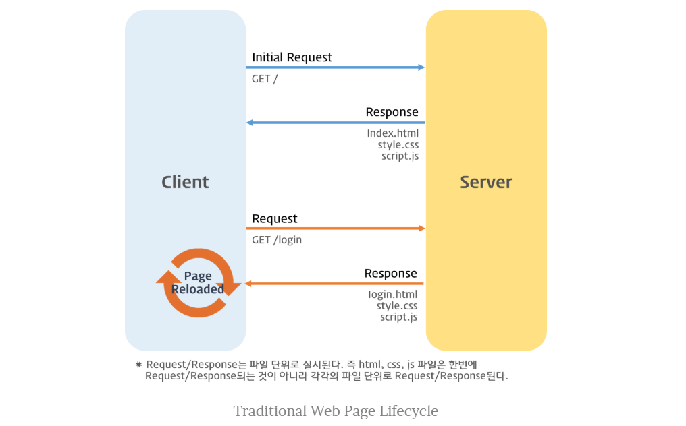
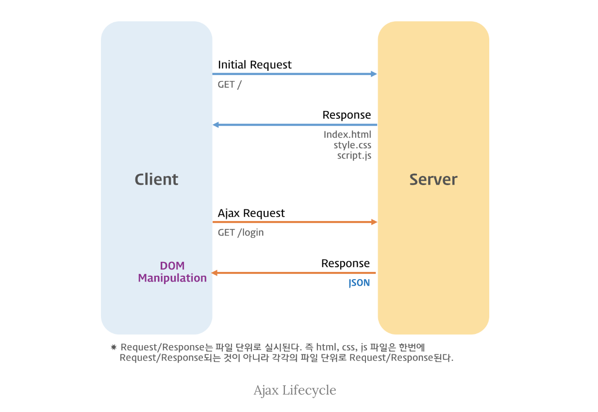

#### 폴리필 (polyfill)
브라우저가 지원하지 않는 코드를 브라우저에서 사용할 수 있도록 변환한 코드 조각이나 플러그인

#### 트랜스파일 (transpile)
최신 버전의 코드를 예전 버전의 코드로 변환하는 과정

#### Ecma 인터내셔널
국제 표준화 기구로서 ECMAScript라는 이름으로 자바스크립트 표준화를 공식화했다.

#### 웹 사이트
웹사이트는 수집된 데이터 및 정보를 특정 페이지에 표시하기 위한 정적 웹으로, 단방향 정보 제공만을 하며 사용자와 상호 작용 하지 않는다.   동적으로 업데이트 되지 않는다.

#### 웹 애플리케이션
사용자와 상호작용하는 쌍방향 소통의 웹을 말한다. 웹 페이지 내부에 수많은 애플리케이션이 동작하고 있다.

#### AJAX
AJAX는 Asynchronous JavaScript And XML의 줄임말입니다. 이는 자바스크립트를 사용해서 비동기적으로 리퀘스트를 보내고 리스폰스를 받는데 기반이 되는 기술들의 집합을 의미합니다.  즉, AJAX는 웹 브라우저가 현재 페이지를 그대로 유지한 채로 서버에 리퀘스트를 보내고 리스폰스를 받아서, 새로운 페이지를 로드하지 않고도 페이지에 변화를 줄 수 있게 해주는 기술입니다.
여기서 XML은 AJAX라는 용어가 생겨난 당시에 가장 많은 인기를 누리던 데이터 타입을 뜻합니다. 요즘은 더 가벼운 용량과 JavaScript의 일부라는 장점 때문에 JSON을 많이 사용합니다. JSON과 XML 모두 AJAX에서 정보를 담을 때 사용합니다.
AJAX의 활용
AJAX에서 서버와 통신하기 위해 보내는 HTTP 리퀘스트가 기술의 핵심이라고 할 수 있는데요. 이를 위해서는 기능을 제공하는 객체의 인스턴스가 필요했고, XMLHttpRequest 가 대표적으로 사용된 객체입니다.
요즘은 Fetch API나 XMLHttpRequest 를 기반으로 더 쓰기 편하게 만들어진 axios와 같은 패키지를 사용해서 AJAX를 활용하고 있습니다.

#### 동적 타입 언어
런타임에 변숫값이 할당될 때 해당 값의 타입에 따라 변수 타입이 결정되는 언어. 
이 때문에 코드가 실행되고 나서야 타입을 알 수 있다.

#### JSDoc
API 문서 생성 도구, README.md에 많이 쓰인다.

#### propTypes
리액트에서만 사용 가능한 props의 타입 검사 속성

#### 다트 (Dart)
자바스크립트를 대체하기 위해 구글이 내놓은 새로운 언어, 개발 파편화 때문에 많이 쓰이지 않았다.

#### 슈퍼셋(Superset) 언어
기존 언어에 새로운 기능과 문법을 추가해서 보완, 향상시킨 것.

#### 타입스크립트 인터페이스(interface)
객체 구조를 정의하는 역할.  특정 객체가 가져야하는 속성과 메서드의 집합을 정의하고, 객체가 그 구조를 따르게 강제한다.