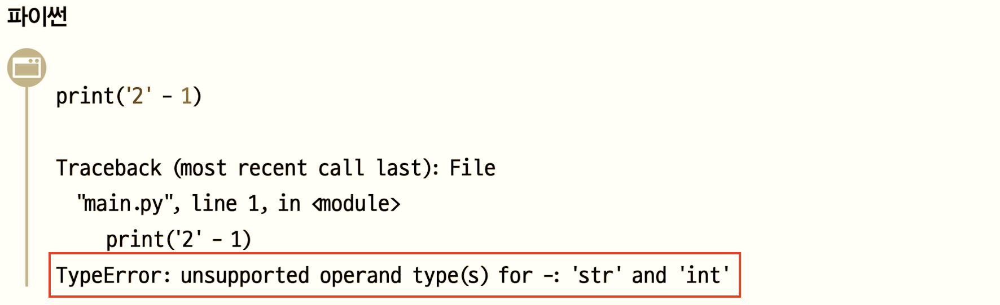
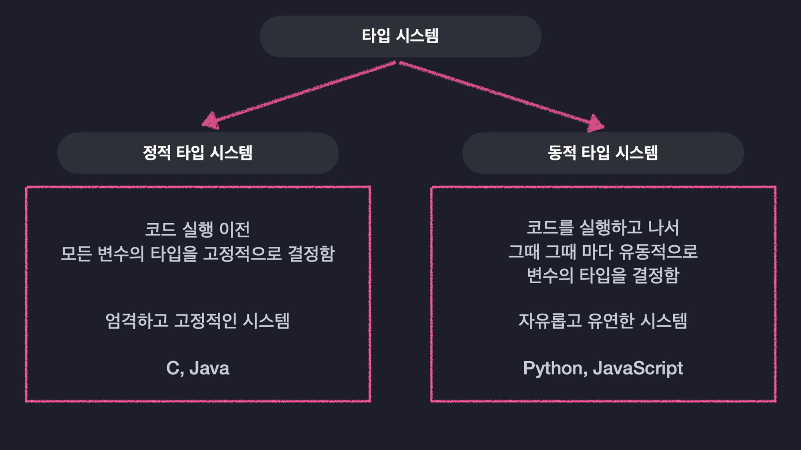
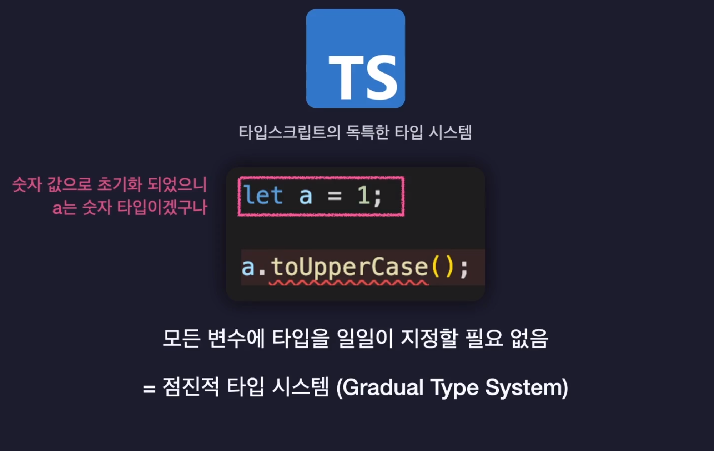
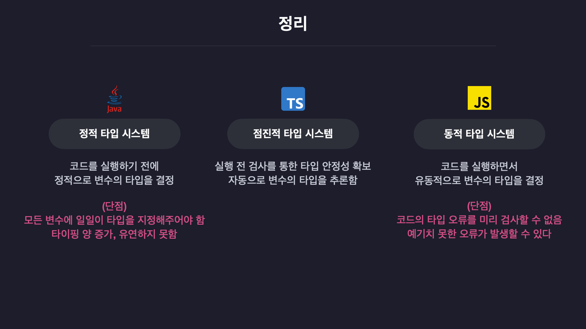

## 타입이란

### 자료형으로서의 타입

#### 데이터 타입, 자료형 (data type)

컴퓨터가 값을 참조할 때, 미리 정해진 데이터 타입에 의해 읽을 메모리 크기를 알 수 있어 메모리 공간을 효율적으로 활용할 수 있다.
<br> 그러기 위해서 값의 종류를 지정하며, ECMAScript 표준으로 7가지가 정의돼있다.

##### - undefined

##### - null

##### - Boolean

##### - String

##### - symbol

##### - Numeric

##### - Object

 <br>
그러나 직접적으로 메모리 효율이 좋아지는 것은 아니다.
코드 최적화, 오류감지, 생산성 향상으로 인한 간접적 향상이다.
<br><br>

### 정적 타입(static), 동적 타입(dynamic)


데이터 타입을 결정하는 시점(컴파일)에 따라 정적 타입과 동적 타입으로 나뉜다 <br>
정적은 변수 타입이 코드 수준에서 명시를 하지만 동적은 **런타임**에서 결정된다.

#### 컴파일타임, 런타임

컴파일타임: 기계(컴퓨터, 엔진)가 코드를 이해할 수 있도록 기계어로 변환되는 시점<br>
런타임: 컴파일타임 이후 변환된 파일이 메모리에 적재되어 실행되는 시점
<br><br>

### 강타입(strongly), 약타입(weakly)

개발자가 의도적으로 타입을 명시, 변환하지 않았는데도 컴파일러, 엔진 등에 의해 런타임에 타입이 자동 변경되는 것을 암묵적 타입 변환(Implicit conversion)이라고 한다.<br>
이 여부에 따라 강타입, 약타입으로 분류된다. **강타입**은 서로 다른 타입을 갖는 값끼리 연산을 시도하면 컴파일, 인터프리터에서 에러가 발생한다. 반대로 **약타입**은 내부적으로 판단해 특정 값의 타입을 변환, 연산, 값 도출을 해낸다.


#### 타입 시스템




타입 검사기가 프로그램에 타입을 할당하는 데 사용하는 규칙 집합<br> 타입스크립트는 명시적으로 타입을 정하는 타입 시스템과 자동으로 타입을 추론하는 타입 시스템 두 가지 모두 사용할 수 있다.
<br><br>

### 컴파일 방식

#### 컴파일

사람이 이해할 수 있는 방식으로 작성한 코드를 기계어로 바꿔주는 과정. <br> 변환된 코드는 바이너리(binary)코드라고 하며 0과 1로 이루어져있다.
<br><br>
타입스크립트의 컴파일 결과물은 여전히 사람이 이해할 수 있는 방식인 자바스크립트 파일이다. 탄생목적이 자바스크립트의 컴파일타임에 런타임 에러를 사전에 잡아내기 위한 것이다.
<br><br>

### 타입 애너테이션 방식(type annotation)

변수, 상수, 함수의 인자, 반환 값에 타입을 명시적으로 선언해서 어떤 타입 값이 저장될 것인지를 컴파일러에 직접 알려주는 문법.<br> 프로그램에게 추가적인 정보를 제공해주는 메타데이터(meta data: 데이터를 위한 데이터)라고 볼 수 있다.<br> 애너테이션의 용도를 살펴보자면 다음과 같다.

- 1.컴파일러에게 코드 작성 문법 에러를 체크하도록 정보를 제공
- 2.소프트웨어 개발툴이 빌드나 배치시 코드를 자동으로 생성할 수 있도록 정보 제공
- 3.실행시(런타임시)특정 기능을 실행하도록 정보를 제공<br><br>

### 구조적 타이핑

#### 명목적으로 구체화한 타입 시스템 (Nominal Reified Type Systems)

타입이 이름으로 구분되며 컴파일타임 이후에도 남아있다.

#### 구조적 타이핑(Structural type system)

구조로 타입을 구분한다.

### 구조적 서브타이핑(Structural Subtyping)

객체가 가지고 있는 속성을 바탕으로 타입을 구분하는 것.<br> 이름이 다른 객체라도 가진 속성이 동일하다면 호환이 가능한 동일한 타입으로 여긴다.<br>
타입스크립트의 타입은 값의 집합(set of values)으로 생각할 수 있다. 타입은 단지 집합에 포함되는 값이고, 특정 값은 많은 집합에 포함될 수 있다.
```ts
interface A {
  a: string;
}

interface B {
  b: number;
}

function printA(arg: A) {
  console.log(arg.a);
}

const x = { a: 'abc' };
const y = { b: 42 };
const z = { a: 'abc', b: 42 };
const w = { a: 'abc', b: 42, c: true };

printA(x);
printA(y); // 잘못된 타입
printA(z);
printA(w);
```