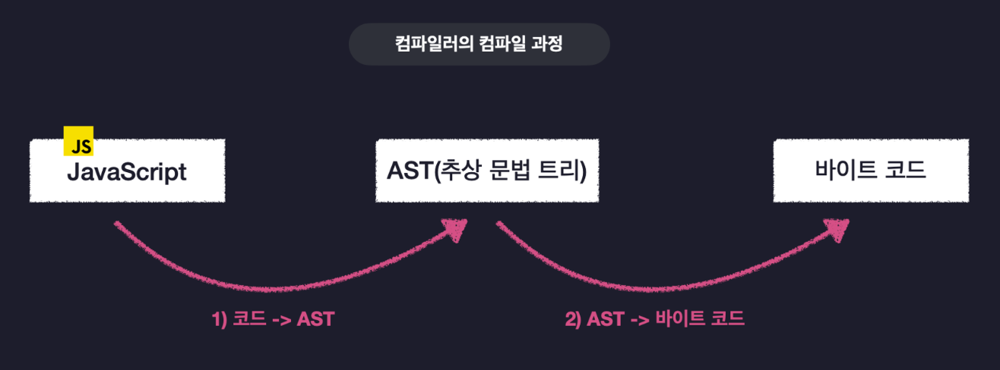

# 6장. 타입스크립트 컴파일

## 6-1. 자바스크립트의 런타임과 타입스크립트의 컴파일

- **컴파일**
대다수의 프로그래밍 언어는 컴파일러를 통한 컴파일 과정을 갖는다. 개발자가 이해할 수 있는 고수준의 소스 코드는 컴파일을 통해기계가 이해할 수 있는 저수준의 언어로 변환된다. 저수준으로 변환되는 과정은 보통 사진과 같다.

- **컴파일타임**: 컴파일러에 의해 기계어 코드로 변환되어 실행이 가능한 프로그램이 되는 단계
- **런타임**: 컴파일 완료 후 프로그램이 메모리에 적재되어 실행되는 **단계 및 환경**

### 1. 자바스크립트의 런타임

- 자바스크립트의 런타임은 자바스크립트가 실행되는 환경으로 대표적으로 브라우저와 Node.js 등이 있다.
- 자바스크립트 런타임은 자바스크립트 엔진, 웹 API, 콜백 큐, 이벤트 루프 등으로 구성된다.
- 애플리케이션이 실행 도중에 TypeError와 같은 에러가 발생한다면 그것은 런타임에서 에러가 발생하는 것이다.

### 2. 타입스크립트의 컴파일

- 사실 컴파일은 고수준 -> 저수준으로의 언어 변환 뿐 아니라, 고수준 -> 다른 고수준 언어로의 변환의 의미를 포함한다.
- 고수준 -> 다른 고수준 언어로의 변환은 **트랜스파일**이라고도 부르며 컴파일은 트랜스파일까지 포함하여 지칭하는 용어이다.
- 타입스크립트의 컴파일은 **tsc**라고 불리는 컴파일러를 이용해 **타입스크립트를 자바스크립트로 변환**하는 과정을 말한다.
- 타입스크립트 컴파일러부터 프로그램이 실행되기까지의 과정은 다음과 같다.
  1. 타입스크립트 소스코드를 타입스크립트 AST(추상 문법 트리)로 만든다. (tsc)
  2. 타입 검사기가 AST를 확인하여 타입을 확인한다. (tsc)
  3. 타입스크립트 AST를 자바스크립트 소스로 변환(트랜스파일)한다. (tsc)
  4. 자바스크립트 소스코드를 자바스크립트 AST로 만든다. (런타임)
  5. AST가 바이트 코드로 변환된다. (런타임)
  6. 런타임에서 바이트 코드가 평가되어 프로그램이 실행된다. (런타임)
  
- 타입스크립트 소스코드는 1~2 단계에서만 사용되며, **자바스크립트로 트랜스파일되는 단계부터는 타입 정보가 사라진다.**
- 타입스크립트에서 정의한 타입은 컴파일타임에 에러 확인에 사용된다. 따라서 **컴파일타임에서부터 에러를 발견하여 런타임에서의 오작동이나 에러를 방지할 수 있다.**

이미지 출처) [인프런 - 한 입 크기로 잘라먹는 타입스크립트](https://www.inflearn.com/course/%ED%95%9C%EC%9E%85-%ED%81%AC%EA%B8%B0-%ED%83%80%EC%9E%85%EC%8A%A4%ED%81%AC%EB%A6%BD%ED%8A%B8?inst=68d752f7&utm_source=instructor&utm_medium=referral&utm_campaign=inflearn_%ED%8A%B8%EB%9E%98%ED%94%BD_promotion-link)