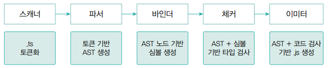
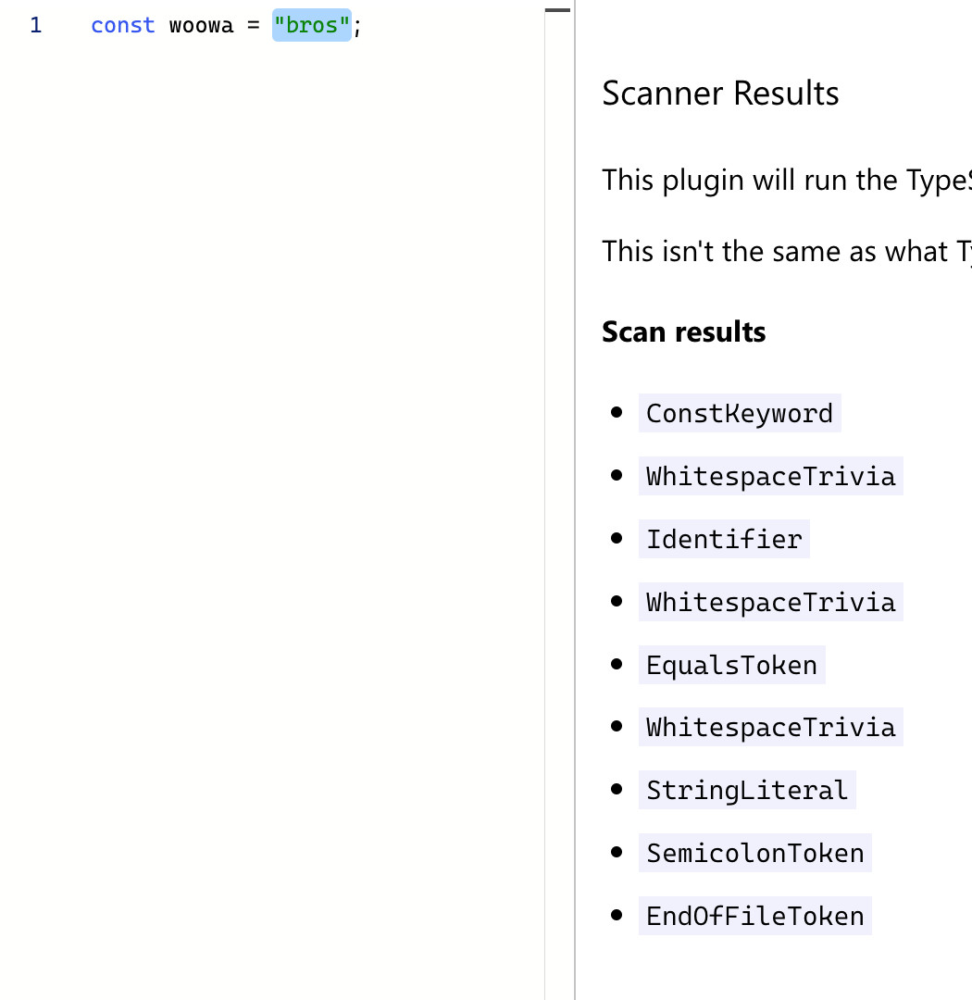
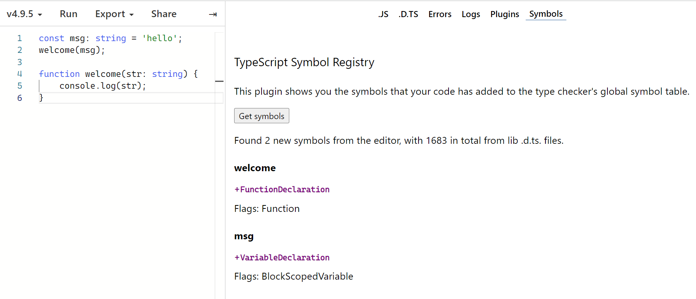

## 6-3. 타입스크립트 컴파일의 과정

타입스크립트는 다섯 단계를 거쳐 타입 검사와 자바스크립트 트랜스파일을 진행한다.



### 1. 프로그램(Program)

- 타입스크립트 컴파일러는 tsc 명령어로 실행되고, 컴파일러는 tsconfig.json에 명시된 옵션을 기반으로 컴파일을 수행한다.
- 먼저 **전체적인 컴파일 과정을 관리하는 프로그램 객체(인스턴스)**를 생성한다.
- 프로그램 객체는 컴파일할 타입스크립트 소스 파일과 소스 파일 내의 임포트 파일을 불러와 컴파일 과정을 시작한다.

### 2. 스캐너(Scanner)

- 스캐너는 타입스크립트 소스코드를 작은 단위로 나누어 **의미 있는 토큰**으로 변환한다.


### 3. 파서(Parser)

- 파서는 스캐너가 만든 토큰의 정보를 이용하여 **AST를 생성**한다.
- **AST(Abstract Syntax Tree)**: 추상 문법 트리는 컴파일러가 동작하는 데 핵심 기반이 되는 자료 구조로, 소스코드의 구조를 트리 형태로 표현한다.
- 코드의 실질적인 구조를 노드 단위의 트리 형태로 표현하며, 각각의 노드는 코드상의 위치, 구문 종류, 코드 내용 등의 정보를 담고 있다.


### 4. 바인더(Binder)

- 바인더는 체커 단계에서 타입 검사를 할 수 있는 기반을 마련하기 위해, **심볼**이라는 데이터 구조를 생성한다.
- **심볼(Symbol)**: 선언한 타입의 AST에서의 노드 정보를 저장한다.
- 심볼의 인터페이스 일부
  ```ts
  export interface Symbol {
    flags: SymbolFlags; // Symbol flags
    escapedName: string; // Name of symbol
    declarations?: Declaration[]; // Declarations associated with this symbol
    // 이하 생략...
  }
  ```
  - flags: 선언한 타입을 구분하는 식별자
    ```ts
    export const enum SymbolFlags {
      None = 0,
      FunctionScopedVariable = 1 << 0, // Variable (var) or parameter
      BlockScopedVariable = 1 << 1, // A block-scoped variable (let or const)
      Property = 1 << 2, // Property or enum member
      EnumMember = 1 << 3, // Enum member
      Function = 1 << 4, // Function
      Class = 1 << 5, // Class
      Interface = 1 << 6, // Interface
      // ...
      // 🌟 <<는 비트연산자이다.
      // 1 << 2는 0001을 0100으로 비트 이동하는 것을 뜻하며 십진수로 4이다.
    }
    ```
  - declarations: AST 노드의 배열 형태로 심볼에 대응하는 AST 노드 정보를 담는다.



### 5. 체커(Checker) & 이미터(Emitter)

- **체커**는 AST 노드를 탐색하면서 심볼 정보를 불러와 소스코드에 대한 **타입 검사**를 진행한다.
- **이미터**는 체커를 통해 코드에 대한 타입 검증 정보를 가져온 후 **자바스크립트로 트랜스파일**을 진행한다.

이미지 출처) "우아한 타입스크립트 with 리액트", 우아한형제들, 한빛미디어