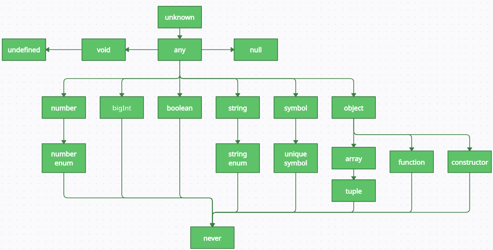

> # 3.1 타입스크립트만의 독자적 타입 시스템

- 자바스크립트의 typeof 연산자나 Object.prototype.toString.call(...)를 사용하여 콘솔에서 변수 타입을 추적해봐도 any라는 문자열을 반환하는 경우를 찾을 수 없음
- `any 타입은 타입스크립트에만 존재하는 독자적인 타입 시스템`으로 간주 가능 BUT `개념은 자바스크립트에 기인한 타입 시스템`

<p align="center">
    
</p>

### any 타입

- 자바스크립트에 존재하는 `모든 값을 오류로 받을 수 있음`
- `지양해야 할 패턴`
- 어쩔 수 없이 사용해야 할 때
  - 개발 단계에서 임시로 값을 지정해야 할 때
  - 어떤 값을 받아올지 또는 넘겨줄지 정할 수 없을 때
  - 값을 예측할 수 없을 때

### unknown 타입

- `모든 타입의 값이 할당될 수 있음` <br>
  BUT `any를 제외한 다른 타입으로 선언된 변수에는 unknown 타입 값을 할당할 수 없음`
- any 타입과 유사하지만 타입 검사를 강제하고 타입이 식별된 후에 사용할 수 있기 때문에 `any 타입보다 안전`함
- 데이터 구조를 파악하기 힘들 때 any 타입 대신 unknown 타입으로 대체해서 사용하는 방법이 권장됨

| any                                                                                          | unknown                                                                                           |
| -------------------------------------------------------------------------------------------- | ------------------------------------------------------------------------------------------------- |
| - 어떤 타입이든 any 타입에 할당 가능 - any 타입은 어떤 타입으로도 할당 가능(단 never는 제외) | - 어떤 타입이든 unknown 타입에 할당 가능 - unknown 타입은 any 타입 외에 다른 타입으로 할당 불가능 |

### void 타입

- 타입스크립트에서 `함수가 어떤 값을 반환하지 않는 경우`에 void를 지정하여 사용

### never 타입

- `값을 반환할 수 없는 타입`
- 자바스크립트에서 값을 반환할 수 없는 예

  - 에러를 던지는 경우

  ```ts
  function generateError(res: Response): never {
    throw new Error(res.getMessage());
  }
  ```

  - 무한히 함수가 실행되는 경우

  ```ts
  function checkStatus(): never {
    while (true) {
      // ...
    }
  }
  ```

- never 타입은 `모든 타입의 하위 타입`

### Array 타입

- 사전에 허용하지 않은 타입이 서로 섞이는 것을 방지하여 타입 `안정성을 제공`

```ts
const array: number[] = [1, 2, 3];
const array: Array<number> = [1, 2, 3];
```

- 튜플은 길이까지 제한하여 원소 개수와 타입을 보장

### enum 타입

- 열거형이라고도 부르는데 타입스크립트에서 지원하는 특수한 언어
- 기본적인 추론 방식은 숫자 0부터 1씩 늘려가며 값을 할당하는 것
- 숫자로만 이루어져 있거나 타입스크립트가 자동으로 추론한 열거형은 `안전하지 못한 결과를 낳을 수 있음`
- 역방향으로 접근 가능
- 타입스크립트 코드가 자바스크립트로 변환될 때 즉시 실행 함수(IIFE) 형식으로 변환됨
  - 이때 일부 번들러에서 트리쉐이킹 과정 중 즉시 실행 함수로 변환된 값을 사용하지 않는 코드로 인식하지 못하는 경우가 발생할 수 있음
  - 따라서 불필요한 코드의 크기가 증가하는 결과 초래 가능
- const enum을 사용하면 역방향으로의 접근을 허용하지 않음

```ts
enum ProgrammingLanguage {
  Typescript, // 0
  Javascript, // 1
  Java, // 2
  Python, // 3
  Kotlin, // 4
  Rust, // 5
  Go, // 6
}

ProgrammingLanguage.Typescript; // 0
ProgrammingLanguage.Rust; // 5
ProgrammingLanguage['Go']; // 6
ProgrammingLanguage[2]; // 'Java'

enum ProgrammingLanguage {
  Typescript = 'Typescript',
  Javascript = 'Javascript',
  Java = 300,
  Python = 400,
  Kotlin, // 401
  Rust, // 402
  Go, // 403
}

--------------------------------------------------------------------

const enum NUMBER {
  ONE = 1,
  TWO = 2,
}
const myNumber: NUMBER = 10; // NUMBER enum에서 100을 관리하고 있지 않지만 이는 에러를 발생시키지 않는다 -> 타입스크립트 5버전 이후로는 에러가 발생하지 않음

const enum STRING_NUMBER {
  ONE = 'ONE',
  TWO = 'TWO',
}
const myStringNumber: STRING_NUMBER = 'THREE'; // Error
```

> # 3.2 타입 조합

### 교차 타입(Intersection)

- A & B 타입 A와 타입 B를 모두 만족하는 경우
- 여러 가지 타입을 결합하여 하나의 단일 타입으로 만들 수 있음
- `기존에 존재하는 다른 타입들을 합쳐서 해당 타입의 모든 멤버를 가지는 새로운 타입을 생성하는 것`

```ts
type ProductItem = {
  id: number;
  name: string;
  type: string;
  price: number;
  imageUrl: string;
  quantity: number;
};

type ProductItemWithDiscount = ProductItem & { discountAmount: number };
```

### 유니온 타입(Union)

- A | B 타입 A 또는 타입 B 중 하나가 될 수 있는 경우
- 주로 `특정 변수가 가질 수 있는 타입을 전부 나열`하는 용도로 사용

```ts
type CardItem = {
  id: number;
  name: string;
  type: string;
  imageUrl: string;
};

type PromotionEventItem = ProductItem | CardItem;

const printPromotionItem = (item: PromotionEventItem) => {
  console.log(item.name); // 0

  console.log(item.quantity); // 컴파일 에러 발생 (CardItem에는 quantity가 없기 때문)
};
```

### 인덱스 시그니처(Index Signatures)

- `특정 타입의 속성 이름은 알 수 없지만 속성값의 타입을 알고 있을 때 사용`하는 문법
- 인터페이스 내부에 [Key: T]: T 꼴로 타입을 명시해주면 됨
  - 해당 타입의 속성 키는 모두 K 타입이어야 하고 속성 값은 모두 T 타입을 가져야 한다는 의미

```ts
interface IndexSignatureEx {
  [Key: string]: number;
}
```

- 인덱스 시그니처를 선언할 때 다른 속성을 추가로 명시해줄 수 있는데 이때 `추가로 명시된 속성은 인덱스 시그니처에 포함되는 타입이어야 함`
  - 아래 예시는 그렇지 않기 때문에 에러 발생

```ts
interface IndexSignatureEx2 {
  [Key: string]: number | number;
  length: number;
  isValid: boolean;
  name: string; // 에러 발생
}
```

### 인덱스드 엑세스 타입(Indexed Access Types)

- `다른 타입의 특정 속성이 가지는 타입을 조회하기 위해 사용`

```ts
type Example = {
  a: number;
  b: string;
  c: boolean;
};

type IndexedAccess = Example['a'];
type IndexedAccess2 = Example['a' | 'b']; // number | string
type IndexedAccess3 = Example[keyof Example]; // number | string | boolean

type ExAlias = 'b' | 'c';
type IndexedAccess4 = Example[ExAlias]; // string | boolean
```

### 맵드 타입(Mapped Types)

- 다른 타입을 기반으로 한 타입을 선언할 때 사용하는 문법인데, 인덱스 시그니처 문법을 사용해서 `반복적인 타입 선언을 효과적으로 줄일 수 있음`

```ts
type Example = {
  a: number;
  b: string;
  c: boolean;
};

type Subset<T> = {
  [K in keyof T]?: T[K];
};

const aExample: Subset<Example> = { a: 3 };
const bExample: Subset<Example> = { b: 'hello' };
const aExample: Subset<Example> = { a: 4, c: true };
```

### 템플릿 리터럴 타입(Template)

- 템플릿 리터럴 문자열을 사용하여 `문자열 리터럴 타입을 선언할 수 있는 문법`

```ts
type: Stage =
| 'init';
| 'select-image';
| 'decorate-card';
| 'edit-image';
| 'capture-image';
type StageName = `${stage}-stage`;
// 'init-stage' | 'select-image-stage' | 'decorate-card-stage' | 'edit-image-stage' | 'capture-image-stage'
```

### 제네릭(Generic)

- 정적 언어에서 다양한 타입 간에 `재사용성을 높이기 위해 사용하는 문법`
- 사용할 타입을 미리 정해두지 않고 타입 변수를 사용해서 해당 위치를 비워 둔 다음에. 실제로 그 값을 사용할 때 외부에서 타입 변수 자리에 타입을 지정하여 사용하는 방식

```ts
type ExampleArrayType<T> = T[];

const array1: ExampleArrayType<string> = ['치킨', '피자', '우동'];
```

```ts
function exampleFunc<T>(arg: T)L T[] {
  return new Array(3).fill(arg);
}

exampleFunc("hello"); // T는 string으로 추론된다.
```

```ts
interface SubmitEvent<T = HTMLElement> extends SyntheticEvent<T> {
  submitter: T;
}
// 특정 요소 타입을 알 수 없을 때는 제네릭 타입에 기본값을 추가할 수 있음
```

- 특정한 타입에서만 존재하는 멤버를 참조하려고 하면 안됨(ex. length -> 모든 타입이 length 속성을 사용할 수는 없기 때문)

```ts
function exampleFunc2<T>(arg: T): number {
  return arg.length; // 에러 발생: Property 'length' does not exist on type 'T'
}

interface TypeWithLength {
  length: number;
}

function exampleFunc2<T extends TypeWithLength>(arg: T): number {
  return arg.length;
}
// 이렇게 'length 속성을 가진 타입만 받는다고' 추가하면 length 속성을 사용할 수 있게 만들어줄 수 있음
```

- 파일 확장자가 tsx일 때 화살표 함수에 제네릭을 사용하면 에러 발생(보통 function 키워드로 선언하는 경우가 많음)

```ts
//에러 발생: JSX element 'T' has no corresponding closing tag
const arrowExampleFunc = <T>(arg: T): T[] => {
  return new Array(3).fill(arg);
};

//에러 발생 X
const arrowExampleFunc2 = <T extends {}>(arg: T): T[] => {
  return new Array(3).fill(arg);
};
```

> # 3.3 제네릭 사용법

### 함수의 제네릭

```ts
function ReadOnlyRepository<T>(target: ObjectType<T> | EntitySchema<T> | string);
Repository<T> {
  return getConnection('ro').getRepository(target);
}
```

### 호출 시그니처의 제네릭

- 호출 시그니처는 타입스크립트의 함수 타입 문법으로 함수의 매개변수와 반환 타입을 미리 선언하는 것
- 함수 호출 시 필요한 타입을 별도로 지정 가능
- 호출 시그니처를 사용할 때 제네릭 타입을 어디에 위치시키는지에 따라 타입의 범위와 제네릭 타입을 언제 구체 타입으로 한정할지 결정 가능

```ts
interface useSelectPaginationProps<T> {
  categoryAtom: RecoilState<number>;
  filterAtom: RecoilState<string[]>;
  sortAtom: RecoilState<SortType>;
  fetcherFunc: (props: CommonListRequest) => Promise<DefaultResponse<ContentListResponse<T>>>;
}
```

### 제네릭 클래스

- 제네릭 클래스는 외부에서 입력된 타입을 클래스 내부에 적용할 수 있는 클래스

```js
class LocalDB<T> {
  // ...
  async put(table: string, row: T): Promise<T> {
    return new Promise<T>((resolved, rejected) => { /* T 타입의 데이터를 DB에 저장 */ });
  }

  async get(table:string, key: any): Promise<T> {
    return new Promise<T>((resolved, rejected) => { /* T 타입의 데이터를 DB에서 가져옴 */ });
  }

  async get(table:string: Promise<T[]> {
    return new Promise<T[]>((resolved, rejected) => { /* T[] 타입의 데이터를 DB에서 가져옴 */ });
  }

  export default class IndexedDB implements ICacheStore {
    private _DB?: LocalDB<{ key: string; value: Promise<Record<string, unknown>>; cacheTTL: number }>;

    private DB() {
      if(!this._DB) {
        this._DB = new LocalDB("localCache", { ver: 6, tables: [{ name: TABLE_NAME, keyPath: "key }] });
      }
      return this._DB;
    }
    // ...
  }
}
```

### 제한된 제네릭

- 타입 매개변수에 대한 제약 조건을 설정하는 기능을 말함
- 상속받을 수 있는 타입으로는 기본 타입뿐만 아니라 상황에 따라 인터페이스, 클래스도 사용 할 수 있다.(유니온 타입을 상속해서 선언도 가능)

```ts
// 예를 들어 string 타입으로 제약하려면 타입 매개변수는 특정 타입을 상속(extends) 해야 한다.

type ErrorRecord<Key extends string> = Exclude<Key, ErrorCodeType> extends never
  ? Partial<Record<Key, boolean>>
  : never;
```

- 위의 예시처럼 타입 매개변수가 특정 타입으로 묶였을 때 키를 바운드 타입 매개변수(bounded type parameters)라고 부르며 string을 키의 상한 한계(upper bound)라고 한다.

### 확장된 제네릭

- 제네릭 타입은 여러 타입을 상속받을 수 있으며 타입 매개변수를 여러 개 둘 수 있음

```ts
<Key extends string>
// 이런식으로 제약해버리면 제네릭의 유연성을 잃어버림
// -> 타입 매개변수에 유니온 타입을 상속해서 선언

<Key extends string | number>
// 유니온 타입으로 T가 여러 타입을 받게 할 수는 있지만, 타입 매개변수가 여러 개일 때는 처리할 수 없음
// 이럴 때는 매개변수를 하나 더 추가하여 선언
```

### 제네릭 예시

- 제네릭의 장점은 다양한 타입을 받게 함으로써 코드를 효율적으로 재사용할 수 있는 것
- API 응답 값의 타입을 지정할 때 많이 활용

```ts
export interfface MobileApiResponse<Data> {
  data: Data;
  statusCode: string;
  statusMessage?: string;
}

// API 응답 값에 따라 달라지는 data를 제네릭 타입 Data로 선언하고 있기 때문에 효율적으로 재사용 가능
```

- 제네릭을 굳이 사용하지 않아도 되는 타입

  - 필요하지 않은 곳에서 사용하면 코드 길이만 늘어나고 가독성을 해칠 수 있음

  ```ts
  type GType<T> = T;
  type RequirementType = "USE" | "UN_USE" | |"NON_SELECT";
  interface Order {
    getRequirement(): GType<RequirementType>;
  }

  type RequirementType = "USE" | "UN_USE" | |"NON_SELECT";
  interface Order {
    getRequirement(): RequirementType;
  }

  // GType이라는 이름이 현재 사용되고 있는 목적의 의미를 정확히 담고 있지도 않고
  // 굳이 제네릭을 사용하지 않고 타입 매개변수를 그대로 선언하는 것과 같은 기능을 하고 있음
  ```

  - any 사용하기

  ```ts
  type ReturnType<T = any> = {
    // ...
  };

  // any를 사용하면 제네릭의 장점과 타입 추론 및 타입 검사를 할 수 있는 이점을 누릴 수 없게됨
  ```

  - 가독성을 고려하지 않은 사용

  ```ts
  ReturnType<
    Record<OrderType, Partial<Record<CommonOrderStatus | CommonReturnStatus, Partial<Record<OrderRoleType, string[]>>>>>
  >;

  type CommonStatus = CommonOrderStatus | CommonReturnStatus;

  type PartialOrderRole = Partial<Record<OrderRoleType, string[]>>;

  type RecordCommonOrder = Record<CommonStatus, PartialOrderRole>;

  type RecordOrder = Record<OrderType, Partial<RecordCommonOrder>>;

  ReturnType<RecordOrder>;

  // 제네릭을 과하게 사용하면 가독성을 해치기 때문에 코드를 읽고 타입을 이해하기 어려워진다.
  ```
