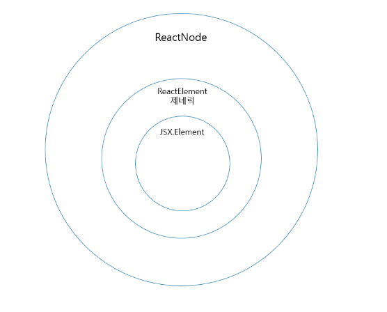

<h1>JSX에서 TSX로</h1>

# 📝 리액트 컴포넌트의 타입

## ✏️ 클래스 컴포넌트 타입

[@types/react Component 정의](https://github.com/DefinitelyTyped/DefinitelyTyped/blob/0e9ea1e1d4cf9663452c8511564ad421f783708b/types/react/index.d.ts#L475)

```ts
interface Component<P = {}, S = {}, SS = any>
  extends ComponentLifecycle<P, S, SS> {}

class Component<P, S> {
  /** 생략 */
}

class PureComponent<P = {}, S = {}, SS = any> extends Component<P, S, SS> {}
```

- 클래스 컴포넌트가 상속받는 React.Component와 React.PureComponent의 타입 정의는 위와 같으며 P와 S는 각각 props와 상태를 의미한다.

## ✏️ 함수 컴포넌트 타입

```ts
interface WelcomeProps {
  name: string;
}

// 함수 선언식
function Welcome(props: WelcomeProps): JSX.Element {}

// 함수 표현식
const Welcome: React.FC<WelcomeProps> = ({ name }) => {};

// 함수 표현식 - React.VFC 사용(version 18 이후 삭제되었다. )
const Welcome: React.VFC<WelcomeProps> = ({ name }) => {};
```

- **리액트 v18로 넘어오면서 React.VFC가 삭제되고 React.FC에서 children이 사라졌다.**
- 앞으로는 React.VFC 대신 React.FC 또는 props 타입, 반환 타입을 직접 지정하는 형태로 타이핑해줘야 한다.

## ✏️ Children props 타입 지정

### 1. 직접 children에 대한 타입 선언해주기

```tsx
interface Props {
  children: ReactNode;
}

function Button({ children }: Props) {
  return <button>{children}</button>;
}
```

### 2. PropsWithChildren 타입 사용하기

```tsx
// React에서 제공하는 타입
type PropsWithChildren<P> = P & { children?: ReactNode | undefined };

interface Props {
  onClick: () => void;
}

function Modal({ onClick, children }: PropsWithChildren<Props>) {
  return <button onClick={onClick}>{children}</button>;
}
```

- 가장 보편적인 children 타입은 `ReactNode | undefined`가 된다.
- `PropsWithChildren` 타입은 children이 존재할 경우와 아닐 경우 모두 에러가 뜨지 않는다.

### 🚨 StrictPropsWithChildren

- [StrictPropsWithChildren 출처](https://velog.io/@kkojae91/PropsWithChildren%EB%8A%94-%EC%95%88%EC%A0%84%ED%95%9C-%ED%83%80%EC%9E%85%EC%9D%BC%EA%B9%8C)

```ts
export type StrictPropsWithChildren<P = unknown> = P & {
  children: ReactNode;
};
```

- children에 옵셔널을 제거함으로써 `children을 넘겨주지 않을 경우 에러가 띄워질 수 있도록` 설정이 가능하다.

## ✏️ render 메서드와 함수 컴포넌트의 반환 타입 - React.ReactElement vs. JSX.Element vs. React.ReactNode 활용하기

- React.ReactElement, JSX.Element, React.ReactNode 타입은 쉽게 헷갈릴 수 있다.

### ReactElement 타입

```ts
interface ReactElement<
  P = any,
  T extends string | JSXElementConstructor<any> =
    | string
    | JSXElementConstructor<any>
> {
  type: T;
  props: P;
  key: Key | null;
}
```

- React.createElement를 호출하는 형태의 구문으로 변환하면 React.createElement의 반환 타입은 ReactElement이다.
- 리액트는 실제 DOM이 아니라 가상의 DOM을 기반으로 렌더링하는데 `가상 DOM의 엘리먼트는 ReactElement 형태로 저장`된다.
- ReactElement 타입은 `JSX의 createElement 메서드 호출로 생성된 리액트 엘리먼트를 나타내는 타입`

### JSX.ELement 타입

```ts
declare global {
  namespace JSX {
    interface ELement extends React.ReactElement<any, any> {}
  }
}
```

- JSX.Element 타입은 리액트의 ReactElement를 확장하고 있는 타입이며, 글로벌 네임스페이스에 정의되어 있어 외부 라이브러리에서 컴포넌트 타입을 재정의할 수 있는 유연성을 제공한다.

  ### 💡글로벌 네임스페이스(Global Namespace)

  - 프로그래밍에서 식별자(변수, 함수, 타입 등)가 정의되는 전역적인 범위
  - 어떠한 파일이든지 해당 스코프에서 선언된 식별자는 모든 곳에서 접근할 수 있다.

### React.ReactNode 타입

```ts
type ReactText = string | number;
type ReactChild = ReactElement | ReactText;
type ReactFragment = {} | Iterable<ReactNode>;

// ReactNode 타입
type ReactNode =
  | ReactChild
  | ReactFragment
  | ReactPortal
  | boolean
  | null
  | undefined;
```

- `ReactNode는 리액트의 render 함수가 반환할 수 있는 모든 형태를 담고 있다.`
- JSX 형태의 문법을 때로는 string, number, null, undefined 같이 어떤 타입이든 children prop으로 지정할 수 있게 하고 싶다면 ReactNode 타입으로 children을 선언하면 된다.

### ReactNode, JSX.Element, ReactElement 사이의 포함 관계



## ✏️ 사용 예시

### ReactNode 사용 예시

- 리액트의 `Composition(합성)` 모델을 활용하기 위해 prop으로 children을 많이 사용해 봤을 것이다.

  ```ts
  // React에 정의되어 있는 PropsWithChildren 타입
  type PropsWithChildren<P = unknown> = P & {
    children?: ReactNode | undefined;
  };

  // ReactNode 직접 선언
  interface MyComponentProps {
    children?: React.ReactNode;
    // ...
  }

  // PropsWithChildren
  type MyComponentProps = PropsWithChildren<MyProps>;
  ```

  - PropsWithChildren 타입도 children을 ReactNode 타입으로 선언하고 있다.

### JSX.Element 사용 예시

- 리액트 엘리먼트를 prop으로 전달 받아 render props 패턴으로 컴포넌트를 구현할 때 유용하게 활용할 수 있다.

  ```tsx
  interface Props {
    icon: JSX.Element;
  }

  const Item = ({ icon }: Props) => {
    // prop으로 받은 컴포넌트의 props에 접근할 수 있다.
    const iconSize = icon.props.size;

    return <li>{icon}</li>;
  };

  // icon prop에는 JSX.Element 타입을 가진 요소만 할당할 수 있다.
  const App = () => {
    return <Item icon={<Icon size={14} />} />;
  };
  ```

### ReactElement 사용 예시

- 앞서 살펴본 JSX.Element 예시를 확장하여 추론 관점에서 더 유용하게 활용할 수 있는 방법은 JSX.Element 대신에 ReactElement를 사용하는 것이다.
- `ReactElement의 제네릭으로 props를 설정할 수 있기 때문에 prop으로 받은 컴포넌트의 props에 접근할 때 목록이 추론`된다.

  ```tsx
  interface IconProps {
    size: number;
  }

  interface Props {
    icon: React.ReactElement<IconProps>;
  }

  const Item = ({ icon }: Props) => {
    // icon prop으로 받은 컴포넌트의 컴포넌트의 props에 접근하면, props의 목록이 추론된다.
    const iconSize = icon.props.size;
    return <li>{icon}</li>;
  };
  ```

## ✏️ 리액트에서 기본 HTML 요소 타입 활용하기

- 기존 HTML 태그의 속성 타입을 활용하여 타입을 지정하는 방법에 대해 알아보자.
- HTML 태그의 속성 타입을 활용하는 대표적인 2가지 방법은 리액트의 `DetailedHTMLProps`와 `ComponentPropsWithoutRef` 타입을 활용하는 것이다.

### DetailedHTMLProps

```ts
// DetailedHTMLProps 활용 방법
type NativeButtonProps = React.DetailedHTMLProps<
  React.ButtonHTMLAttributes<HTMLButtonElement>,
  HTMLButtonElement
>;

type ButtonProps = {
  onClick?: NativeButtonProps["onClick"];
};
```

- 특정 HTML 요소의 모든 속성(기본 HTML 속성 및 React 추가 속성)을 포함하는 타입을 정의하는 데 사용된다.
- 이를 통해 특정 HTML 요소의 타입 안전성을 보장할 수 있다.

### ComponentPropsWithoutRef

```ts
// ComponentPropsWithoutRef 활용 방법
type NativeButtonType = React.ComponentPropsWithoutRef<"button">;
type ButtonProps = {
  onClick?: NativeButtonType["onClick"];
};
```

- ref 속성을 포함하지 않는 컴포넌트의 타입을 정의할 때 사용된다.
- 이는 주로 `forwardRef를 사용하지 않는 컴포넌트에 적합`하다.

### 언제 ComponentPropsWithoutRef를 사용하면 좋을까? [`ref`를 props로 내려줘야 하는 경우]

- 클래스 컴포넌트와 함수 컴포넌트에서 ref를 props로 받아 전달하는 방식에 차이가 있다.

  ```tsx
  class WrappedButton extends React.Component {
    constructor() {
      this.buttonRef = React.createRef();
    }

    render() {
      return (
        <div>
          <Button ref={this.buttonRef} />
        </div>
      );
    }
  }
  ```

  - 클래스 컴포넌트로 만들어진 버튼은 ref가 Button 컴포넌트의 button 태그를 그대로 바라보게 된다.
  - 🚨 하지만 함수 컴포넌트의 경우, 전달받은 ref가 Button 컴포넌트의 button 태그를 바라보지 않는다.
  - 클래스 컴포넌트에서 ref 객체는 마운트된 컴포넌트의 인스턴스를 current 속성값으로 가지지만, 함수 컴포넌트에서는 생성된 인스턴스가 없기 때문에 ref에 기대한 값이 할당되지 않는 것이다.
  - 이러한 제약을 극복하고 함수 컴포넌트에서도 ref를 전달받을 수 있도록 도와주는 것이 `React.forwardRef`메서드이다.

```tsx
type NativeButtonType = React.ComponentPropsWithoutRef<"button">;

const Button = forwardRef<HTMLButtonElement, NativeButtonType>((props, ref) => {
  return (
    <button ref={ref} {...props}>
      버튼
    </button>
  );
});
```

- forwardRef는 2개의 제네릭 인자를 받을 수 있는데, 첫 번째는 ref에 대한 타입 정보, 두 번째는 props에 대한 타입 정보이다.
- 함수 컴포넌트의 props로 DetailedHTMLProps와 같이 ref를 포함하는 타입을 사용하게 되면, 실제로는 동작하지 않는 ref를 받도록 타입이 지정되어 예기치 않은 에러가 발생할 수 있다.
- 따라서, **HTML 속성을 확장하는 props를 설계할 때는 `ComponentPropsWithoutRef` 타입을 사용하여 ref가 실제로 forwardRef와 함께 사용될 때만 props로 전달되도록 타입을 정의하는 것이 안전하다.**

<br/>
<br/>

# 📝 TS로 리액트 컴포넌트 만들기

## ✏️ JSX로 구현된 Select 컴포넌트

```jsx
const Select = ({ onSelect, options, selectedOption }) => {
  const handleChange = (e) => {
    const selected = Object.entries(options).find(
      ([_, value]) => value === e.target.value
    )?.[0];
    onChange?.(selected);
  };

  return (
    <select
      onChange={handleChange}
      value={selectedOption && options[selectedOption]}
    >
      {Object.entries(options).map(([key, value]) => (
        <option key={key} value={value}>
          {value}
        </option>
      ))}
    </select>
  );
};
```

## ✏️ JSDocs로 일부 타입 지정하기

```js
/**
 * Select 컴포넌트
 * @param {Object} props - Select 컴포넌트로 넘겨주는 속성
 * @param {Object} props.options - { [key: string]: string } 형식으로 이루어진 option 객체
 * @param {string | undefined} props.selectedOption - 현재 선택된 option의 key 값(optional)
 * @param {function} props.onChange - select 값이 변경되었을 때 불리는 callback 함수
 * @returns {JSX.Element}
 */
const Select = // ...
```

- JSDocs를 활용하면 컴포넌트에 대한 설명과 각 속성이 어떤 역할을 하는지 간단하게 알려줄 수 있다.

## ✏️ props 인터페이스 적용하기

- JSX로 구현된 Select 컴포넌트를 TSX로 순차적으로 변경해보자

```tsx
type Option = Record<string, string>; // {[key: string]: string}
// 🚨 넓은 범위의 타입은 해당 타입을 사용하는 함수에 잘못된 타입이 전달될 수 있기 때문에, 가능한 한 타입을 좁게 제한하여 사용하길 권장한다.

interface SelectProps {
  options: Option;
  selectedOption?: string;
  onChange?: (selected?: string) => void;
}

const Select = ({
  options,
  selectedOption,
  onChange,
}: SelectProps): JSX.Element => {
  // ...
};
```

## ✏️ 리액트 이벤트

- 리액트는 가상DOM을 다루면서 이벤트도 별도로 관리한다.
- 리액트 컴포넌트에 등록되는 이벤트 리스너는 onClick, onChange처럼 `카멜 케이스`로 표기한다.
- 리액트 이벤트 핸들러는 이벤트 버블링 단계에서 호출된다.
- 이벤트 캡처 단계에서 이벤트 핸들러를 등록하기 위해서는 onClickCapture, onChangeCapture와 같이 일반 이벤트 리스너 이름 뒤에 `Captrue`를 붙여야 한다.
- 또한, 리액트는 브라우저 이벤트를 합성한 [합성 이벤트(SyntheticEvent)](https://ko.legacy.reactjs.org/docs/events.html)를 제공한다.

```tsx
// Select 컴포넌트의 이벤트 핸들러에 타입을 지정해주자.
const Select = ({ onChange, options, selectedOption }: SelectProps) => {
  const handleChange: React.ChangeEventHandler<HTMLSelectElement> = (e) => {
    const selected = Object.entries(options).find(
      ([_, val]) => val === e.target.value
    )?.[0];
    onChange?.(selected);
  };

  return <select onChange={handleChange}>{/* ... */}</select>;
};
```

## ✏️ 훅에 타입 추가하기

- 아래 예시는 Select 컴포넌트를 사용하여 과일을 선택할 수 있는 컴포넌트를 나타낸 것이다.

  ```tsx
  const fruits = {
    apple: "사과",
    banana: "바나나",
    blueberry: "블루베리",
  };

  type Fruit = keyof typeof fruits;

  const FruitSelect: VFC = () => {
    // 변경 전 코드
    const [fruit, changeFruit] = useState();

    // 변경 후 코드
    const [fruit, changeFruit] = useState<Fruit | undefined>("apple");

    return (
      <Select onChange={changeFruit} options={fruit} selectedOption={fruit} />
    );
  };
  ```

  - fruit가 반드시 apple, banana, blueberry 중 하나라고 기대하고 있을 것이다.
  - 하지만 useState에 제네릭 타입을 지정해주지 않는다면 fruit 관련된 state값을 사용하는 onChange의 타입이 일치하지 않아 오류가 발생한다.
  - 또한, 제네릭을 string 타입으로 정한다면 fruit 타입에 속하지 않는 과일이 들어왔을 때 컴파일러가 오류를 검출하지 않는 사이드 이펙트가 발생한다.

## ✏️ 제네릭 컴포넌트 만들기

- 현재 selectedOption은 options에 존재하지 않는 값을 받아도 아무론 오류가 발생하지 않는다.(string 타입)
- 따라서, 제네릭을 이용하여 컴포넌트를 재정의할 필요가 있다.

```tsx
// 변경 전
interface SelectProps {
  options: Option;
  selectedOptions?: string;
  onChange?: (selected?: string) => void;
}

// 변경 후
interface SelectProps<OptionType extends Record<string, string>> {
  options: OptionType;
  selectedOption?: keyof OptionType;
  onChange?: (selected?: keyof OptionType) => void;
}

const Select = <OptionType extends Record<String, string>>({
  options,
  selectedOption,
  onChange,
}: SelectProps<OptionType>) => {
  /// select component implementation
};
```

## ✏️ HTMLAttributes, ReactProps 적용하기

- 리액트에서 제공하는 타입을 사용하면 HTML attribute의 지정된 타입과 일치하도록 속성을 가져올 수 있다.

  ```ts
  type ReactSelectProps = React.ComponentPropsWithoutRef<"select">;

  interface SelectProps<OptionType extends Record<string, string>> {
    id?: ReactSelectProps["id"];
    className?: ReactSelectProps["className"];
    //...
  }
  ```

- ReactProps에서 여러 개의 타입을 가져와야 한다면 Pick 타입을 활용할 수 있다.

  ```ts
  interface SelectProps<OptionType extends Record<string, string>>
    extends Pick<ReactSelectProps, "id", "key" /*...*/> {
    //...
  }
  ```

## ✏️ styled-components를 활용한 스타일 정의

- CSS-in-JS 라이브러리인 styled-components를 활용하여 리액트 컴포넌트에 스타일 관련 타입을 추가해보자.

```ts
// 스타일 타입 구성
export const theme = {
  fontSize: {
    default: "16px",
    small: "14px",
    large: "18px",
  },
  color: {
    white: "#FFFFFF",
    black: "#000000",
  },
};
type Theme = typeof theme;
export type FontSize = keyof Theme["fontSize"];
export type Color = keyof Theme["color"];
```

```tsx
// style 관련된 props 작성 후 StyledSelect라는 select style 컴포넌트를 정의
interface SelectStyleProps {
  color: Color;
  fontSize: FontSize;
}

const StyledSelect = styled.select<SelectStyleProps>`
  color: ${({ color }) => theme.color[color]};
  font-size: ${({ fontSize }) => theme.fontSize[fontSize]};
`;
```

## ✏️ 공변성과 반공변성

# 📝 정리

```ts
// styled-components 테마 정리
export const theme = {
  fontSize: {
    default: "16px",
    small: "14px",
    large: "18px",
  },
  color: {
    white: "#FFFFFF",
    black: "#000000",
  },
};

type Theme = typeof theme;
export type FontSize = keyof Theme["fontSize"];
export type Color = keyof Theme["color"];
```

```tsx
// styled-components: 커스텀 select 정의
interface SelectStyleProps {
  color: Color;
  fontSize: FontSize;
}

const StyledSelect = styled.select<SelectStyleProps>`
  color: ${({ color }) => theme.color[color]};
  fontsize: ${({ fontSize }) => theme.fontSize[fontSize]};
`;

// Select 컴포넌트 정의
type ReactSelectProps = React.ComponentPropsWithoutRef<"select">;
interface SelectProps<OptionType extends Record<string, string>>
  extends Partial<SelectStyleProps> {
  id?: ReactSelectProps["id"];
  className?: ReactSelectProps["className"];
  options: OptionType;
  selectedOption?: keyof OptionType;
  onChange?: (selected?: keyof OptionType) => void;
}

export const Select = <OptionType extends Record<string, string>>({
  className,
  id,
  options,
  onChange,
  selectedOption,
  fontSize = "default",
  color = "black",
}: SelectProps<OptionType>) => {
  const handleChange: React.ChangeEventHandler<HTMLSelectElement> = (e) => {
    const selected = Object.entries(options).find(
      ([, value]) => value === e.target.value
    )?.[0];
    onChange?.(selected);
  };

  return (
    <StyledSelect
      id={id}
      className={className}
      fontSize={fontSize}
      color={color}
      onChange={handleChange}
      value={selectedOption && options[selectedOption]}
    >
      {Object.entries(options).map(([key, value]) => (
        <option key={key} value={value}>
          {value}
        </option>
      ))}
    </StyledSelect>
  );
};
```

```tsx
const fruits = {
  apple: "사과",
  banana: "바나나",
  blueberry: "블루베리",
};
type Fruit = keyof typeof fruits;

export const FruitSelect = () => {
  const [fruit, changeFruit] = useState<Fruit | undefined>();

  return (
    <Select
      className="fruitSelectBox"
      options={fruits}
      onChange={changeFruit}
      selectedOption={fruit}
      fontSize="large"
    />
  );
};
```
