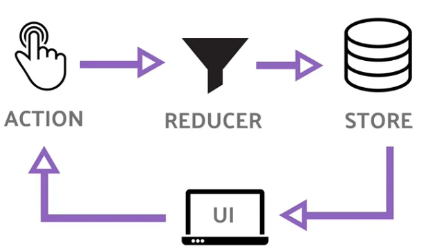

<h1>상태 관리</h1>

# 📝 상태 관리

## ✏️ 상태(State)

- 렌더링 결과에 영향을 주는 정보를 담은 순수 JS 객체
- 값이 변경될 때마다 컴포넌트의 렌더링 결과물에 영향을 준다.
- 지역 상태, 전역 상태, 서버 상태로 분류할 수 있다.

### 지역 상태(Local State)

- 컴포넌트 내부에서 사용되는 상태로 주로 useState 훅을 쓰며 useReducer와 같은 훅도 사용된다.

### 전역 상태(Global State)

- 앱 전체에서 공유하는 상태
- 상태가 변경되면 전역상태를 사용하는 컴포넌트들도 업데이트된다.
- 또한 `Prop drilling` 문제를 피하고자 지역상태를 해당 컴포넌트들 사이의 전역 상태로 공유할 수 있다.

#### Prop drilling?

- props를 통해 데이터를 전달하는 과정에서 중간 컴포넌트는 해당 데이터가 필요하지 않음에도 자식 컴포넌트에 전달하기 위해 props를 전달해야 하는 과정
- 컴포넌트의 수가 많아지면 Prop drilling으로 인해 코드가 훨씬 복잡해질 수 있다.

### 서버 상태(Server State)

- 사용자 정보, 글 목록 등 외부 서버에 저장해야 하는 상태
- react-query, SWR과 같은 외부 라이브러리를 사용하여 관리하기도 합니다.

## ✏️ 상태를 잘 관리하기 위한 가이드

- `상태가 업데이트될 때마다 리렌더링이 발생하기 때문에 유지보수 및 성능 관점에서 상태의 개수를 최소화하는 것이 바람직하다.`
- 가능하다면 상태가 없는 Stateless 컴포넌트를 활용하는 것이 좋다.
- 어떤 값을 상태로 정의할 때는 다음 2가지 사항을 고려해야 한다.
  - 시간이 지나도 변하지 않는다면 상태가 아니다.
  - 파생된 값은 상태가 아니다.

### 시간이 지나도 변하지 않는다면 상태가 아니다.

- 시간이 지나도 변하지 않는 값이라면, `객체 참조 동일성을 유지하는 방법`을 고려할 수 있다.
- 즉, 두 개의 객체가 동일한 메모리 주소를 가지고 있는 방법을 이용하자는 말이다.
- 만약 단순히 상수 변수에 저장하여 사용하게 된다면, 렌더링될 때마다 새로운 인스턴스가 생성되기 때문에 Context나 props 등으로 전달했을 시 매번 다른 객체로 인식되어 불필요한 리렌더링이 자주 발생할 수 있다.

### 객체 참조 동일성을 유지하는 방법

#### 1. 메모이제이션(useMemo)

```ts
const store = useMemo(() => new Store(), []);
```

- `useMemo`를 사용하여 컴포넌트가 마운트될 때만 객체 인스턴스를 생성하고 이후 렌더링에서는 이전 인스턴스를 재활용할 수 있도록 구현할 수 있다.
- 하지만 `useMemo는 오로지 성능 향상을 위한 용도로만 사용하라고 공식문서에 언급`되어있으며 리액트는 메모리 확보를 위해 이전 메모이제이션 데이터를 삭제할 수 있다.
- 따라서 useMemo가 없어도 올바르게 작동되도록 코드를 작성한 뒤 성능개선을 목표로 useMemo를 추가하는 것이 적절한 접근 방식이다

#### 2. useState의 초기값만 지정하는 방법

- `useState(new Store())` 의 방식은 객체 인스턴스가 사용되지 않더라도 렌더링마다 생성되어 초깃값 설정에 큰 비용이 소모될 수 있다. 따라서 `useState(()=> new Store())`와 같이 초깃값을 계산하는 콜백을 지정하는 방식(지연 초기화 방식)을 사용한다.
- 따라서 지연 초기화 방식을 사용하게 되면 그 함수를 사용할 때만 렌더링이 된다.
- 다만 useState를 사용하는 것은 기술적으로는 잘 동작할 수 있지만, 의미론적으로 봤을 때는 좋은 방법이 아니다.
  - 처음에는 상태를 시간이 지나면서 변화되어 렌더링에 영향을 주는 데이터로 정의헀지만, 현재의 목적은 모든 렌더링 과정에서 객체의 참조를 동일하게 유지하고자 하는 것이기 때문이다.

#### 3. useRef

- 리액트 공식 문서에 따르면 useRef가 동일한 객체 참조를 유지하려는 목적으로 사용하기에 가장 적합한 훅이다.
- useRef의 인자로 직접 `new Store()`를 사용하면 useState와 마찬가지로 렌더링마다 불필요한 인스턴스가 생성되므로 아래와 같이 작성해줘야 한다.

```js
const store = useRef < Store > null;
if (!store.current) store.current = new Store();
```

### 파생된 값은 상태가 아니다.

#### 부모에게서 전달받을 수 있는 props이거나 기존 상태에서 계산될 수 있는 값은 상태가 아니다.

- SSOT는 `어떠한 데이터도 단 하나의 출처에서 생성하고 수정해야 한다는 원칙을 의미하는 방법론`이다. 리액트에서 상태를 정의할 때도 이를 고려해야 한다.
- 다른 값에서 파생된 값을 상태로 관리하게 되면 기존 출처와는 다른 새로운 출처에서 관리하게 되는 것이므로 해당 데이터의 정확성과 일관성을 보장하기 어렵다.

```tsx
import { useState, ChangeEvent } from "react";
type UserEmailProps = {
  initialEmail: string;
};

const UserEmail = ({ initialEmail }: UserEmailProps) => {
  const [email, setEmail] = useState(initialEmail);

  const onChangeEmail = (event: ChangeEvent<HTMLInputElement>) => {
    setEmail(event.target.value);
  };

  return <input type="text" value={email} onChange={onChangeEmail} />;
};
```

- 위 컴포넌트에서는 전달받은 initialEmail prop의 값이 변경되어도 input 태그의 value는 변경되지 않는다.
- useState의 초기값으로 설정한 값은 컴포넌트가 마운트될 때 한 번만 email 상태의 값으로 설정되며 이후에는 독자적으로 관리되기 때문이다.

#### 이러한 문제를 해결하기 위해서는 두 출처 간의 데이터를 동기화하기보다는 단일한 출처에서 데이터를 사용하도록 변경해줘야 한다.

- 일반적으로 리액트에서는 상위 컴포넌트에서 상태를 관리하도록 해주는 `상태 끌어올리기 기법(Lifting State Up)을 사용한다.`

```tsx
import { useState, Dispatch, SetStateAction, ChangeEvent } from "react";

type UserEmailProps = {
  email: string;
  setEmail: Dispatch<SetStateAction<string>>;
};

const UserEmail = ({ email, setEmail }: UserEmailProps) => {
  const onChangeEmail = (event: ChangeEvent<HTMLInputElement>) => {
    setEmail(event.target.value);
  };
  return <input type="text" value={email} onChange={onChangeEmail} />;
};
```

#### 다른 예시

```tsx
const [items, setItmes] = useState<Item[]>([]);
const [selectedItems, setSelectedItems] = useState<Item[]>([]);

useEffect(() => {
  setSelectedItems(items.filter((item) => item.isSelected));
}, [items]);
```

- 이러한 방법의 가장 큰 문제점은 items와 selectedItems가 동기화되지 않을 수 있다는 점이다.
- 여러 상태가 복잡하게 얽혀있으면 흐름을 파악하기 어렵고 의도치 않게 동기화 과정이 누락될 수 있다.

- 가장 간단한 방법으로는 상태로 정의하지 않고 계산된 값을 JS 변수에 담는 것이다.

  ```tsx
  // 성능적인 측면에서 items값이 바뀔때만 렌더링이 되기 때문에 위의 예제보다 렌더링 횟수가 줄어든다.
  const [items, setItems] = useState<Item[]>([]);
  const selectedItems = items.filter((item) => item.isSelected);
  ```

  - 다만 이 경우에는 매번 렌더링될 때마다 계산을 수행하게 되므로 계산 비용이 크다면 `useMemo`를 사용하는 방법이 있다.

    ```ts
    const [items, setItems] = useState<Item[]>([]);
    const selectedItems = useMemo(
      () => veryExpensiveCalculation(items),
      [items]
    );
    ```

### useState vs useReducer, 어떤 것을 사용해야 할까?

- useState 대신 useReducer 사용을 권장하는 경우는 크게 두 가지가 있다.
  1. 다수의 하위 필드를 포함하고 있는 복잡한 상태 로직을 다룰 때
  2. 다음 상태가 이전 상태에 의존적일 때

```ts
// 날짜 범위 기준 - 오늘, 1주일, 1개월
type DateRangePreset = "TODAY" | "LAST_WEEK" | "LAST_MONTH";
type ReviewRatingString = "1" | "2" | "3" | "4" | "5";

// 리뷰 날짜 필터링
interface ReviewFilter {
  stateDate: Date;
  endDate: Date;
  dateRangePreset: Nullable<DateRangePreset>;
  keywords: string[];
  ratings: ReviewRatingString[];
  // ...
}

interface State {
  filter: ReviewFilter;
  page: string;
  size: number;
}
```

- 이러한 데이터 구조를 useState로 다룬다면 잠재적인 오류 가능성이 증가한다.
- 예를 들어 페이지 값만 업데이트하고 싶어도 우선 전체 데이터를 가지고 와야하기 때문에 다른 필드가 수정될 수 있는 개발자 오류가 발생할 수 있다.
- 이럴 때 `useReducer`를 사용한다.

  ```tsx
  // Action 정의
  type Action =
    | { payload: ReviewFilter; type: "filter" }
    | { payload: number; type: "navigate" }
    | { payload: number; type: "resize" };

  // Reducer 정의
  const reducer: React.Reducer<State, Action> = (state, action) => {
    switch (action.type) {
      case "filter":
        return {
          filter: action.payload,
          page: 0,
          size: state.size,
        };
      case "navigate":
        return {
          filter: state.filter,
          page: action.payload,
          size: state.size,
        };
      case "resize":
        return {
          filter: state.filter,
          page: 0,
          size: action.payload,
        };
      default:
        return state;
    }
  };

  // useReducer 사용
  const [state, dispatch] = useReducer(reducer, getDefaultState());

  //dispatch 예시
  dispatch({ payload: filter, type: "filter" });
  dispatch({ payload: page, type: "navigate" });
  dispatch({ payload: size, type: "resize" });
  ```

  - useReducer는 `무엇을 변경할지`와 `어떻게 변경할지`를 분리하여 `dispatch`를 통해 어떤 작업을 할지를 액션으로 넘기고 reducer 함수 내에서 상태를 업데이트하는 방식을 정의한다.
  - 이로써 복잡한 상태로직을 숨기고 안정성을 높일 수 있다.

- 이외에도 boolean 상태를 토글하는 액션만 사용하는 경우에는 useState 대신 useReducer를 사용하곤 한다.

  ```tsx
  import { useReducer } from "react";

  // Before
  const [fold, setFold] = useState(true);
  const toggleFold = () => setFold((prev) => !prev);

  // After
  const [fold, toggleFold] = useReducer((v) => !v, true);
  ```

## ✏️ 전역 상태 관리와 상태 관리 라이브러리

- 상태는 사용하는 곳과 최대한 가까워야 하며 사용 범위를 제한해야만 한다.
- 전역 상태를 관리하는 방법은 크게 두 가지로 나뉜다.
  - Context API + useState or useReducer
  - 외부 상태 관리 라이브러리(Redux, MobX, Recoil, Zustand 등)

### 컨텍스트 API(Context API)

- 전역적으로 공유해야 하는 데이터를 Context로 제공하고 해당 Context를 **구독한 컴포넌트에서만** 데이터를 읽을 수 있게 된다.
- 엄밀하게 말해 전역 상태를 관리하기 위한 솔루션보다는 여러 컴포넌트간에 값을 공유하는 솔루션에 가깝다.
- 그러나 대규모 애플리케이션이나 성능이 중요한 애플리케이션에서 권장되지 않는 방법이다.
- 컨텍스트 프로바이더의 props로 주입된 값이나 참조가 변경될 때마다 해당 컨텍스트를 구독하고 있는 모든 컴포넌트가 리렌더링되기 때문에 전역 상태가 많아질수록 불필요한 리렌더링과 상태의 복잡도가 증가한다.

# 📝 상태 관리 라이브러리

## ✏️ MobX

- `객체 지향 프로그래밍`과 반응형 프로그래밍 패러다임의 영향을 받은 라이브러리
- 상태 변경 로직을 단순하게 작성할 수 있고, 복잡한 업데이트 로직을 라이브러리에 위임할 수 있다.
- 다만 데이터가 언제, 어떻게 변하는지 추적하기 어렵기 때문에 트러블슈팅에 어려움을 겪을 수 있다.

```jsx
import React from "react";
import ReactDOM from "react-dom";
import { makeAutoObservable } from "mobx";
import { observer } from "mobx-react";

// 애플리케이션 상태를 모델링합니다.
class Timer {
  secondsPassed = 0;

  constructor() {
    makeAutoObservable(this);
  }

  increase() {
    this.secondsPassed += 1;
  }

  reset() {
    this.secondsPassed = 0;
  }
}

const myTimer = new Timer();

// observable state를 사용하는 사용자 인터페이스를 구축합니다.
const TimerView = observer(({ timer }) => (
  <button onClick={() => timer.reset()}>
    Seconds passed: {timer.secondsPassed}
  </button>
));

ReactDOM.render(<TimerView timer={myTimer} />, document.body);

// 매초마다 Seconds passed: X를 업데이트 합니다.
setInterval(() => {
  myTimer.increase();
}, 1000);
```

- 리렌더링 대상이 되는 상태를 관찰 대상(observable value)라고 칭하며 `observable`로 지정한 상태는 관찰대상으로 지정되고 그 상태는 값이 변경될 때 마다 리렌더링됩니다.

## ✏️ Redux

- 함수형 프로그래밍의 영향을 받은 라이브러리
- 특정 UI 프레임워크에 종속되지 않아 독립적으로 상태 관리 라이브러리를 사용할 수 있다.
- 상태 변경 추적에 최적화되어 있어, 특정 상황에서 발생한 애플리케이션 문제의 원인을 파악하는 데 용이하다.
- 하지만 보일러 플레이트가 많이 필요하고, 사용 난도가 높다는 단점이 있다.

```jsx
import { createStore } from "redux";

function counter(state = 0, action) {
  switch (action.type) {
    case "PLUS":
      return state + 1;
    case "MINUS":
      return state - 1;
    default:
      return state;
  }
}

let store = createStore(counter);
store.subscribe(() => console.log(store.getState()));
store.dispatch({ type: "PLUS" }); // 1
store.dispatch({ type: "PLUS" }); // 2
store.dispatch({ type: "MINUS" }); // 1
```



### Store(스토어)

- 상태가 관리되는 오직 하나의 공간
- 컴포넌트와는 별개로 스토어라는 공간이 있어서 그 스토어 안에 앱에서 필요한 상태를 담는다.
- 컴포넌트에서 상태 정보가 필요할 때 스토어에 접근한다.

### Action(액션)

- 앱에서 스토어에 운반할 데이터
- 자바스크립트 객체 형식으로 되어있다.

### Reducer(리듀서)

- Action을 Store에 바로 전달하는 것이 아니다.
- Action -> Reducer(리듀서는 주문을 보고 스토어의 상태를 업데이트 한다) -> Store
- Action을 Reducer에 전달하기 위해서는 `dispatch()` 메소드를 사용해야한다.

## ✏️ Recoil

- 상태를 저장할 수 있는 `Atom`과 해당 상태를 변형할 수 있는 순수 함수 `selector`를 통해 상태를 관리하는 라이브러리
- Redux에 비해 보일러플레이트가 적고 난이도가 쉽다.
- 적은 업데이트 주기, 메인 개발자의 퇴직으로 인해 신뢰도가 떨어진 편이라 개인적으로는 다른 라이브러리를 추천한다.
- [관련 블로그](https://medium.com/@clockclcok/recoil-%EC%9D%B4%EC%A0%9C%EB%8A%94-%EB%96%A0%EB%82%98-%EB%B3%B4%EB%82%BC-%EC%8B%9C%EA%B0%84%EC%9D%B4%EB%8B%A4-ff2c8674cdd5)

## ✏️ Zustand

- Flux 패턴을 사용하며 많은 보일러플레이트를 가지지 않는 훅 기반의 편리한 API 모듈을 제공한다.
- 클로저를 활용하여 스토어 내부 상태를 관리함으로써 특정 라이브러리에 종속되지 않는 특징이 있다.
- 상태와 상태를 변경하는 액션을 정의하고 반환된 훅을 어느 컴포넌트에서나 임포트하여 원하는 대로 사용할 수 있다.

```tsx
import { create } from "zustand";

const useBearStore = create((set) => ({
  bears: 0,
  increasePopulation: () => set((state) => ({ bears: state.bears + 1 })),
  removeAllBears: () => set({ bears: 0 }),
}));

function BearCounter() {
  const bears = useBearStore((state) => state.bears);
  return <h1>{bears} around here ...</h1>;
}

function Controls() {
  const increasePopulation = useBearStore((state) => state.increasePopulation);
  return <button onClick={increasePopulation}>Plus</button>;
}
```
