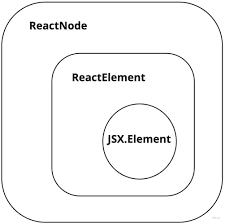

# 8장

## 8.1 리액트 컴포넌트의 타입

### 1. 클래스 컴포넌트 타입

클래스 컴포넌트가 상속받는 `React.Component`와 `React.PureComponent`의 타입 정의는 아래와 같으며, P와 S는 각각 props와 상태(state)를 의미한다.

```ts
interface Component<P = {}, S = {}, SS = any>
  extends ComponentLifeCycle<P, S, SS> {}

class Component<P, S> {
  /* ... 생략 */
}

class PureComponent<P = {}, S = {}, SS = any> extends Component<P, S, SS> {}
```

### 2. 함수 컴포넌트 타입

#### React.FC / React.VFC

- FC : FunctionComponent
- 리액트에서 함수 컴포넌트의 타입 지정을 위해 제공되는 타입
- **함수 표현식**을 사용하여 함수 컴포넌트를 선언할 때 가장 많이 볼 수 있는 형태
- children이라는 타입을 허용하는지 아닌지에 따라 React.FC와 React.VFC로 나뉨
  - React.FC는 암묵적으로 children을 포함
- 현재, React.VFC가 삭제되고, React.FC에서 children이 사라짐
  - React.FC 또는 props 타입, 반환 타입을 직접 지정함

```ts
const Welcome: React.FC<WelcomeProps> = ({ name }) => {};
```

### 3. Children props 타입 지정

```ts
type PropsWithChildren<P> = P & { children?: ReactNode | undefined };
```

`ReactNode | undefined`는 가장 보편적인 children 타입이다.  
ReactNode는 ReactElement 외에도 boolean, number 등 여러 타입을 포함하고 있는 타입으로, 구체적으로 타이핑하는 용도에는 적합하지 않다.

### 4. render 메서드와 함수 컴포넌트의 반환 타입 - React.ReactElement vs. JSX.Element vs React.ReactNode

`ReactElement`와 `JSX.Element`는 리액트 element의 타입을 나타내고 `ReactNode`는 ReactElement를 포함하여 리액트 element의 children으로 올 수 있는 타입을 나타낸다.

#### ReactElement

```ts
interface ReactElement<
  P = any,
  T extends string | JSXElementContructor<any> =
    | string
    | JSXElementConstructor<any>
> {
  type: T;
  props: P;
  key: Key | null;
}
```

ReactElement는 React.createElement 또는 JSX 트랜스파일링의 결과물이다.
type, props, key를 가지는 리액트의 선언형 UI의 기본 구성요소이다.

#### JSX.Element

```ts
declare global {
  namespace JSX {
    interface Element extends React.ReactElement<any, any> {}
  }
}
```

JSX.Element는 React.Element의 type, props 타입을 any로 두어 React.Element보다 타입을 느슨하게 검사하는 타입이다.

<!-- JSX.Element는 함수형 컴포넌트의 리턴 타입이다. 따라서 다양한 커스텀 타입의 element를 구현하고 사용할 수 있다. (?????) -->

#### ReactNode

ReactNode는 ReactElement 뿐만 아니라 string, number 등 여러 타입을 포함하고 있다.  
ReactNode는 리액트 element를 생성하는 함수의 children 타입으로 주로 사용되고, 클래스형 컴포넌트의 render 메소드의 리턴 타입이다.

```ts
type ReactText = string | number;
type ReactChild = ReactElement | ReactText;
type ReactFragment = {} | Iterable<ReactNode>;

type ReactNode =
  | ReactElement
  | string
  | number
  | ReactFragment
  | ReactPortal
  | boolean
  | null
  | undefined;
```

#### ReactNode, JSX.Element, ReactElement 간의 포함 관계



### ReactElement, ReactNode, JSX.Element 활용하기

모두 리액트의 요소(엘리먼트)를 나타내는 타입

#### ReactElement

`ReactElement` 타입은 JSX의 createElement 메서드 호출로 생성된 리액트 엘리먼트를 나타내는 타입

```ts
const jsx: ReactElement = <div>hello</div>;
const ele: ReactElement = React.createElement("div", null, "hello");
```

#### ReactNode

ReactChild  
`ReactChild` 타입은 `ReactElement | string | number`로 정의되어 ReactElement보다는 좀 더 넓은 범위를 갖고 있다.

```ts
type ReactText = string | number;
type ReactChild = ReactElement | ReactText;
```

### 6. 사용 예시

#### ReactNode

ReactNode 타입은 리액트의 render 함수가 반환할 수 있는 모든 형태를 담고 있기 때문에 리액트 컴포넌트가 가질 수 있는 모든 타입을 의미함

ReactNode는 prop으로 리액트 컴포넌트가 다양한 형태를 가질 수 있게 하고 싶을 때 유용하고 사용함

JSX 형태의 문법을 string, number, null, undefined 같이 어떤 타입이든 children prop으로 지정할 수 있게 하고 싶다면 ReactNode 타입으로 children을 선언하면 된다.

```ts
type PropsWithChildren<P = unknown> = P & {
  children?: ReactNode | undefined;
};

interface MyProps {
  // ...
}

type MyComponentProps = PropsWithChildren<MyProps>;
```

#### JSX.Element

리액트 엘리먼트를 prop으로 전달받아 render props 패턴으로 컴포넌트를 구현할 때 유용하게 활용함

```ts
interface Props {
  icon: JSX.Element;
}

const Item = ({ icon }: Props) => {
  // prop으로 받은 컴포넌트의 props에 접근할 수 있다.
  const iconSize = icon.props.size;

  return <li>{icon}</li>
}

// icon prop에는 JSX.Element 타입을 가진 요소만 할당할 수 있다.
const App = () => {
  return <Item icon={<Icon size={14} />}>
}
```

#### ReactElement

```ts
interface IconProps {
  size: number;
}

interface Props {
  // ReactElement의 props 타입으로 IconProps 타입 지정
  icon: React.ReactElement<IconProps>;
}

const Item = ({ icon }: Props) => {
  // icon prop으로 받은 컴포넌트의 props에 접근하면, props의 목록이 추론됨
  const iconSize = icon.props.size;

  return <li>{icon}</li>;
};
```

### 7. 리액트에서 기본 HTML 요소 타입 활용하기

기존 HTML 태그의 속성 타입을 활용하여 타입 지정하는 방법

#### DetailedHTMLProps와 ComponentWithoutRef

```ts
// DetailedHTMLProps
type NativeButtonProps = React.DetailedHTMLProps<
  React.ButtonHTMLAttributes<HTMLButtonElement>,
  HTMLButtonElement
>;

type ButtonProps = {
  onClick?: NativeButtonProps["onClick"];
};
```

```ts
// ComponentWithoutRef
type NativeButtonType = React.ComponentPropsWithoutRef<"button">;
type ButtonProps = {
  onClick?: NativeButtonType;
};
```

#### 언제 ComponentWithoutRef를 사용하면 좋을까

ref를 props로 받을 경우

```ts
// 클래스 컴포넌트로 만들어진 Button 컴포넌트를 사용할 때
class WrappedButton extends React.Component {
  constructor() {
    this.buttonRef = React.createRef();
  }

  render() {
    return (
      <div>
        <Button ref={this.buttonRef} />
      </div>
    );
  }
}
```

클래스 컴포넌트로 만들어진 버튼은 컴포넌트 props로 전달된 ref가 Button 컴포넌트의 button 태그를 그대로 바라보게 된다.

```ts
// 함수 컴포넌트로 만들어진 Button 컴포넌트를 사용할 때
const WrappedButton = () => {
  const buttonRef = useRef();

  return (
    <div>
      <Button ref={buttonRef} />
    </div>
  );
};
```

함수 컴포넌트의 경우 전달받은 ref가 Button 컴포넌트의 button 태그를 바라보지 않는다.  
이유 : 클래스 컴포넌트에서 ref 객체는 마운트된 컴포넌트의 인스턴스를 current 속성값으로 갖지만, 함수 컴포넌트에서는 생성된 인스턴스가 없기 때문에 ref에 기대한 값이 할당되지 않는다.

#### React.forwardRef 메서드 활용

forwardRef는 2개의 제네릭 인자를 받는데, 첫 번째는 ref에 대한 타입 정보, 두 번째는 props에 대한 타입 정보이다.

```ts
type NativeButtonType = React.ComponentPropsWithoutRef<"button">;

// forwardRef의 제네릭 인자를 통해 ref에 대한 타입으로 HTMLButtonElement를, props 타입으로 NativeButtonType을 정의함
const Button = forwardRef<HTMLButtonElement, NativeButtonType>((props, ref) => {
  return (
    <button ref={ref} {...props}>
      버튼
    </button>
  );
});
```

HTML 속성을 확장하는 props를 설계할 때는 ComponentPropsWithoutRef 타입을 사용하여 ref가 실제로 forwardRef와 함께 사용될 때만 props로 전달되도록 타입을 정의하는 것이 안전하다.
